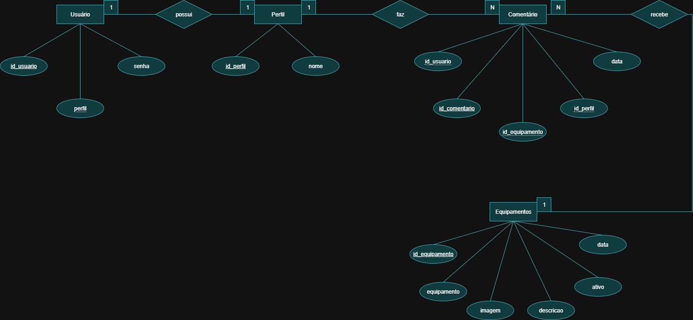
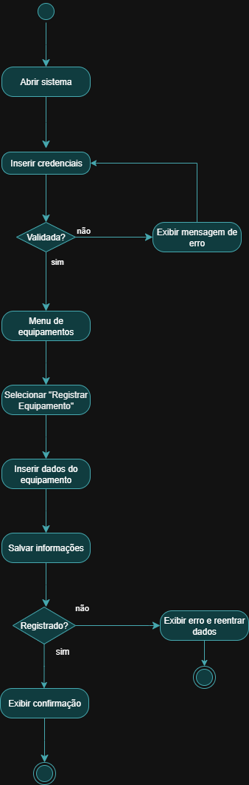
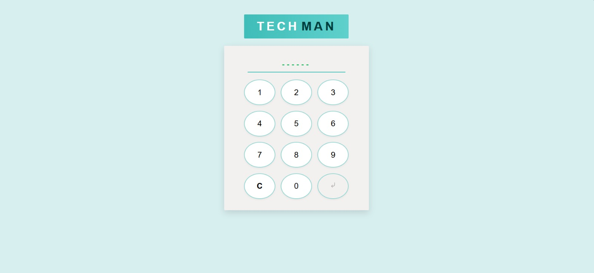
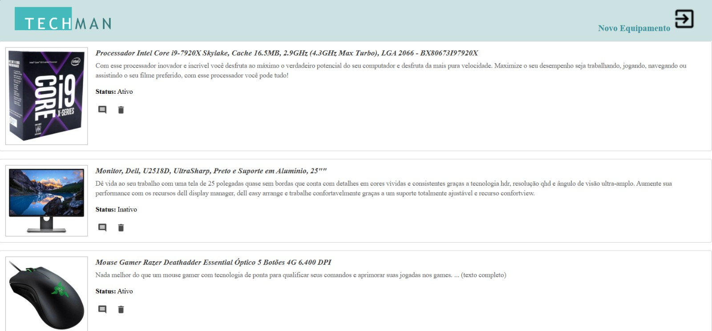

# techman2025

# Aula 06 - Avaliação Prática: Techman

## Contexto
O **Techman** é um sistema para facilitar o controle e gerenciamento de manutenções de equipamentos em indústrias, tornando o processo mais simples e dinâmico.

## Desafio
O sistema deve oferecer:
- **Login de usuários**
- **Gestão de equipamentos** (cadastro e exclusão apenas pelo administrador)
- **Comentários** por equipamento (preventiva, corretiva, configurações, etc.)
- **Histórico/relatório** de equipamentos e comentários

## Diagramas

### 1. Diagrama Entidade-Relacionamento (DER)

### 2. Diagrama de Atividades - Inclusão de Equipamento

---

## Prints das Telas

### 1. Tela de Login

### 2. Tela Inicial

---